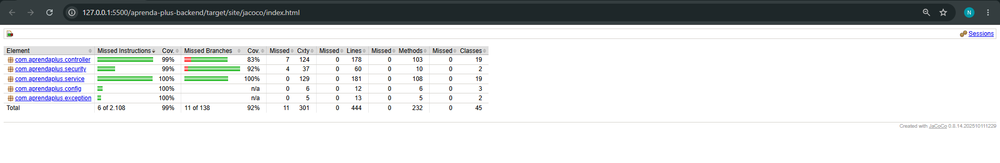
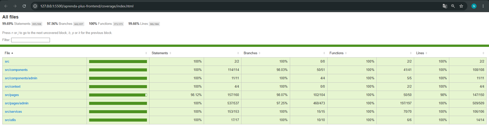

# AprendaPlus 🎓

Plataforma web de **venda de cursos superiores e profissionalizantes**, com loja virtual para os alunos e painel administrativo para a equipe da instituição.

Projeto final do curso **Desenvolvimento Full Stack** do programa **+PraTi / Codifica**.

| | Link |
|---|---|
| 🌐 **Site (front-end)** | https://nattalyb.github.io/aprenda-plus/ |
| ⚙️ **API (back-end)** | https://aprenda-plus-backend.onrender.com |
| 🔐 **Painel administrativo** | https://nattalyb.github.io/aprenda-plus/#/admin/login |

> **Atenção:** o back-end está hospedado no plano gratuito do Render, que "adormece" o servidor depois de alguns minutos sem uso. O primeiro acesso pode levar até 1 minuto para carregar os cursos. Depois disso, o site responde normalmente.

---

## 📑 Sumário

- [Funcionalidades](#-funcionalidades)
- [Tecnologias](#-tecnologias)
- [Arquitetura](#-arquitetura)
- [Estrutura de pastas](#-estrutura-de-pastas)
- [Como rodar localmente](#-como-rodar-localmente)
- [Testes e cobertura](#-testes-e-cobertura)
- [Segurança](#-segurança)
- [Decisões de projeto](#-decisões-de-projeto)
- [Deploy](#-deploy)
- [Metodologia de trabalho](#-metodologia-de-trabalho)
- [Melhorias futuras](#-melhorias-futuras)
- [Equipe](#-equipe)

---

## ✨ Funcionalidades

### Parte I: Site da instituição (área do aluno)

- **Vitrine de cursos** com imagem, nome, mensalidade e valor total.
- **Busca de cursos** que ignora acentos e maiúsculas ("ciencia" encontra "Ciência de Dados"), com **sugestões** enquanto o aluno digita e navegação pelo teclado.
- **Detalhes do curso** em um modal: descrição, carga horária, modalidade, pré-requisitos e conteúdo programático em tópicos.
- **Preço em mensalidades:** cada curso exibe o valor mensal em destaque (ex.: *R$ 500,00/mês em 24x*) e o valor total logo abaixo.
- **Cadastro e login de alunos**, com validação de todos os campos (exceto o complemento do endereço).
- **Carrinho de compras** com contador no topo da página, que se atualiza na hora.
- **Formas de pagamento:**
  - **Pix** à vista com **5% de desconto**;
  - **Cartão de crédito** e **boleto**, parcelados sem juros. O limite de parcelas é o do curso com o menor limite entre os que estão no carrinho.
- **Conclusão da inscrição:** cria uma inscrição para cada curso na primeira turma disponível, com status *pendente de pagamento*, e esvazia o carrinho. O valor de cada inscrição é **calculado pelo servidor** a partir do preço do curso, e não pelo navegador.
- **Avisos visuais (toasts)** de sucesso, erro e alerta.
- **Layout responsivo** para celular, tablet e computador.

### Parte II: Painel administrativo

- **Login exclusivo para funcionários**, separado do login de alunos.
- **CRUD completo** de:
  - Alunos
  - Professores
  - Cursos (com número de parcelas e prévia da mensalidade)
  - Disciplinas
  - Períodos letivos
  - Turmas
  - Matrículas
- **Inscrições:** listagem com a forma de pagamento escolhida pelo aluno e troca de status direto na tabela.
- **Filtros em todas as listas:** busca por nome (e por CPF em alunos, professores e matrículas), além de filtros por categoria, curso ou status.
- **Mensagens de erro detalhadas:** quando o back-end recusa um dado, o formulário mostra exatamente qual campo está errado.

---

## 🛠 Tecnologias

### Back-end

| Tecnologia | Uso |
|---|---|
| **Java 25** | Linguagem |
| **Spring Boot 4.1** | Framework da API REST (Web MVC, Data JPA, Validation, Actuator) |
| **PostgreSQL 17** | Banco de dados |
| **Hibernate / JPA** | Mapeamento objeto-relacional |
| **JJWT 0.12** | Geração e validação dos tokens JWT |
| **BCrypt** (Spring Security Crypto) | Criptografia das senhas |
| **Bean Validation** | Validação dos dados recebidos pela API |
| **JUnit 5 + Mockito + MockMvc** | Testes automatizados |
| **JaCoCo** | Relatório de cobertura de testes |
| **Maven** | Build e dependências |

### Front-end

| Tecnologia | Uso |
|---|---|
| **React 19** | Interface |
| **Vite 8** | Build e servidor de desenvolvimento |
| **React Router 7** | Navegação entre páginas |
| **Axios** | Comunicação com a API |
| **CSS puro** | Estilização e responsividade |
| **Jest 30 + Testing Library** | Testes automatizados e cobertura |

### Infraestrutura

| Serviço | Uso |
|---|---|
| **Render** | Hospedagem do back-end e do banco PostgreSQL |
| **GitHub Pages** | Hospedagem do front-end |
| **GitHub** | Versionamento e organização das tarefas |

---

## 🏗 Arquitetura

O sistema é dividido em duas aplicações independentes que se comunicam por uma **API REST** em JSON:

```
┌────────────────────────┐         HTTPS + JSON          ┌────────────────────────┐        ┌──────────────┐
│   Front-end (React)    │  ───────────────────────────▶ │  Back-end (Spring Boot)│ ─────▶ │  PostgreSQL  │
│   GitHub Pages         │  ◀───────────────────────────  │  Render                │ ◀───── │  Render      │
│                        │   token JWT no cabeçalho      │                        │        │              │
└────────────────────────┘   Authorization: Bearer ...   └────────────────────────┘        └──────────────┘
```

### Camadas do back-end

```
Requisição ─▶ AuthInterceptor ─▶ Controller ─▶ Service ─▶ Repository ─▶ Banco
              (confere o token    (recebe e      (regras de   (acesso aos
               e as permissões)    valida os      negócio)     dados, JPA)
                                   dados)
```

- **Controller:** recebe as requisições HTTP e valida os dados com `@Valid`.
- **Service:** concentra as regras de negócio (ex.: criptografar a senha, manter a senha atual quando o admin edita um aluno sem informar senha nova, calcular o valor da inscrição com o desconto do Pix e conferir o limite de parcelas).
- **Repository:** interfaces do Spring Data JPA.
- **Entity:** classes que representam as tabelas do banco.
- **Security:** geração e validação do JWT e controle de acesso às rotas.
- **Exception:** tratamento centralizado dos erros (`GlobalExceptionHandler`). Erros de validação devolvem quais campos falharam; erros de regra de negócio (`RegraDeNegocioException`) devolvem uma mensagem pronta para mostrar na tela.

### Organização do front-end

- **pages:** telas do site e do painel admin.
- **components:** partes reutilizáveis (cabeçalho, rodapé, modal do curso, preço, avisos, layout do admin).
- **services:** uma camada para cada recurso da API. O `api.js` envia o token automaticamente e trata a sessão expirada.
- **context:** estado compartilhado da busca de cursos.
- **utils:** funções de cálculo e formatação (preço, mensalidade, imagens dos cursos).

---

## 📁 Estrutura de pastas

```
aprenda-plus/
├── aprenda-plus-backend/
│   ├── database/                  # Scripts SQL de criação do banco
│   ├── src/main/java/com/aprendaplus/
│   │   ├── config/                # CORS e registro da proteção da API
│   │   ├── controller/            # Endpoints REST
│   │   ├── entity/                # Entidades JPA
│   │   ├── exception/             # Tratamento centralizado de erros
│   │   ├── repository/            # Acesso ao banco
│   │   ├── security/              # JWT e controle de acesso
│   │   └── service/               # Regras de negócio
│   ├── src/main/resources/
│   │   └── application.properties
│   ├── src/test/java/com/aprendaplus/   # Testes (JUnit + Mockito)
│   └── pom.xml
│
├── aprenda-plus-frontend/
│   ├── src/
│   │   ├── assets/                # Logos e banners dos cursos
│   │   ├── components/            # Componentes reutilizáveis
│   │   ├── context/               # Contexto da busca
│   │   ├── pages/                 # Telas do site
│   │   │   └── admin/             # Telas do painel administrativo
│   │   ├── services/              # Comunicação com a API
│   │   ├── utils/                 # Funções auxiliares
│   │   └── *.test.jsx             # Testes (ficam junto de cada arquivo)
│   ├── jest.config.cjs
│   ├── babel.config.cjs
│   └── package.json
│
└── docs/                          # Imagens usadas neste README
```

---

## 💻 Como rodar localmente

### Pré-requisitos

- **Java 25** (ou superior)
- **Node.js 22** (ou superior) e npm
- **PostgreSQL 17**
- **Git**

### 1. Clonar o repositório

```bash
git clone https://github.com/NattalyB/aprenda-plus.git
cd aprenda-plus
```

### 2. Criar o banco de dados

Crie um banco chamado `aprenda_plus` no PostgreSQL e execute os scripts da pasta `aprenda-plus-backend/database`, que criam as tabelas, os valores padrão e os gatilhos.

> O back-end usa `spring.jpa.hibernate.ddl-auto=validate`: o Hibernate **não cria nem altera tabelas**, ele só confere se o banco está igual às entidades. Por isso, os scripts SQL precisam ser executados antes de subir a aplicação.

### 3. Configurar e rodar o back-end

As configurações ficam em `aprenda-plus-backend/src/main/resources/application.properties`. Ajuste o usuário e a senha do seu PostgreSQL local:

```properties
spring.datasource.url=jdbc:postgresql://localhost:5432/aprenda_plus
spring.datasource.username=postgres
spring.datasource.password=SUA_SENHA
```

A chave que assina os tokens JWT vem da variável de ambiente `JWT_SECRET`. Se ela não existir, a aplicação usa uma chave de desenvolvimento, o que é suficiente para rodar localmente.

```bash
cd aprenda-plus-backend
./mvnw spring-boot:run
```

A API fica disponível em `http://localhost:8080`.

### 4. Rodar o front-end

Em outro terminal:

```bash
cd aprenda-plus-frontend
npm install
npm run dev
```

O site abre em `http://localhost:5173/aprenda-plus/`.

O endereço da API é definido pelos arquivos de ambiente do Vite:

| Arquivo | Usado em | Valor |
|---|---|---|
| `.env.development` | `npm run dev` | `VITE_API_URL=http://localhost:8080` |
| `.env.production` | `npm run build` / deploy | `VITE_API_URL=https://aprenda-plus-backend.onrender.com` |

> Para rodar o front local conectado à API publicada no Render, basta apagar o `.env.development`.

---

## 🧪 Testes e cobertura

A meta do projeto era **cobertura mínima de 70%**. Os dois lados ficaram bem acima:

| | Testes | Cobertura | Ferramentas |
|---|---|---|---|
| **Back-end** | 246 | **99%** das instruções, 89% dos desvios (*branches*) | JUnit 5, Mockito, MockMvc, JaCoCo |
| **Front-end** | 236 | **99,7%** das instruções, 97,6% dos desvios, 100% das funções | Jest, Testing Library |

### Back-end

```bash
cd aprenda-plus-backend
./mvnw clean test
```

O relatório de cobertura é gerado em `target/site/jacoco/index.html`.

O que é testado:

- **Services:** regras de negócio, incluindo a criptografia de senha, a manutenção da senha atual na edição, os casos de registro não encontrado e o **cálculo do valor da inscrição** (desconto do Pix com arredondamento em centavos, valor cheio no cartão e no boleto, limite de parcelas do curso e formas de pagamento inválidas).
- **Controllers:** todas as rotas (listar, buscar, criar, editar e excluir), a validação dos dados recebidos e as mensagens de erro.
- **Segurança:** geração e validação do JWT (inclusive tokens adulterados ou assinados com outra chave), as permissões de cada perfil, a regra de que um aluno só mexe no **próprio** carrinho e a tentativa de criar uma inscrição adulterada (em nome de outro aluno, já confirmada ou pagando R$ 0,01).
- **Configuração:** registro da proteção da API e liberação de CORS só para os endereços autorizados.

> As entidades (classes só com getters e setters) ficam fora do cálculo de cobertura, por não terem lógica a testar.



### Front-end

```bash
cd aprenda-plus-frontend
npm test                # roda os testes
npm run test:coverage   # roda os testes e mede a cobertura
```

O relatório é gerado em `coverage/index.html`. Se a cobertura cair abaixo de 70%, o comando falha automaticamente.

O que é testado:

- **Services e utils:** todas as rotas da API, o envio automático do token, o logout quando a sessão expira e os cálculos de preço e mensalidade.
- **Componentes:** cabeçalho (busca, sugestões, teclado e contador do carrinho), modal do curso, avisos e rota protegida do admin.
- **Páginas:** Home, login, cadastro, carrinho (Pix com desconto, cartão, boleto, limite de parcelas, curso sem turma e mensagem de erro vinda do servidor), além de todas as listas e formulários do painel admin.



---

## 🔒 Segurança

- **Senhas criptografadas com BCrypt.** O hash da senha **nunca** é devolvido pela API (`@JsonProperty(access = WRITE_ONLY)`).
- **Autenticação com JWT:** no login, a API gera um token assinado que identifica o usuário e o seu papel (`ALUNO` ou `ADMIN`) e expira em **2 horas**.
- **Controle de acesso por papel**, feito pelo `AuthInterceptor` antes de cada requisição:

| Quem | Pode acessar |
|---|---|
| **Visitante** | Ver cursos e turmas, cadastrar-se e fazer login |
| **Aluno** | O próprio carrinho e a criação de inscrições |
| **Admin** | Todas as rotas |

- **Cada aluno só vê e altera o próprio carrinho:** a identidade vem do token assinado pelo servidor, não de dados enviados pelo navegador.
- **Inscrição à prova de adulteração:** quando um aluno finaliza a compra, o navegador só informa a **turma** e a **forma de pagamento**. Todo o resto é definido pelo servidor:
  - o **aluno** é sempre o do token (não dá para se inscrever em nome de outra pessoa);
  - o **status** sempre começa como *pendente de pagamento* (o aluno não consegue se autoconfirmar);
  - o **valor** é recalculado a partir do preço do curso gravado no banco, com o desconto do Pix aplicado no servidor;
  - o **número de parcelas** é conferido com o limite do curso. Se alguém tentar parcelar acima do permitido ou usar uma forma de pagamento inexistente, a API recusa com uma mensagem clara.

  Assim, mesmo que alguém altere a requisição pelas ferramentas do navegador (por exemplo, mudando o valor para R$ 0,01), a inscrição é gravada com o valor correto.
- **Chave secreta fora do código:** em produção, a chave que assina os tokens fica em uma variável de ambiente no Render (`JWT_SECRET`), já que o repositório é público.
- **CORS** liberado apenas para o site publicado e para o ambiente de desenvolvimento local.
- **Validação dupla:** os formulários validam no navegador, e a API valida de novo no servidor (Bean Validation), já que é possível chamar a API sem passar pelo site.
- **Sessão expirada:** quando o token expira, o front-end limpa o login e leva o usuário de volta para a tela de login automaticamente.

---

## 💡 Decisões de projeto

- **Pagamento simulado.** A forma de pagamento escolhida pelo aluno é registrada na inscrição, mas nenhum pagamento real é processado. Integrar um gateway de pagamento (Mercado Pago, Stripe...) estava fora do escopo. Por isso, **o sistema não pede nem armazena dados de cartão**: guardar esses dados sem um gateway certificado violaria as normas de segurança do setor (PCI-DSS).
- **Inscrição × Matrícula.** O fluxo foi pensado em duas etapas: o aluno se **inscreve** e escolhe como vai pagar (status *pendente de pagamento*). Depois que a secretaria confirma, ela cria a **matrícula** pelo painel admin. A tabela de pagamentos, ligada à matrícula, já está modelada para controlar as parcelas.
- **Mensalidade calculada, não digitada.** O admin cadastra o **valor total** e o **número de parcelas** do curso, e o sistema calcula a mensalidade. Assim ela nunca fica diferente do valor total.
- **Desconto de 5% no Pix**, como é comum em instituições de ensino. O valor já é gravado com desconto na inscrição.
- **O servidor é a fonte da verdade do preço.** O front-end calcula os valores só para mostrar ao aluno; o valor que vale é o calculado pelo back-end com `BigDecimal` (arredondamento em centavos), a partir do preço do curso no banco. Nunca se confia em um valor enviado pelo navegador.
- **Admin com liberdade no painel.** O recálculo e as travas valem para as compras feitas pelos alunos. O admin continua podendo criar e editar inscrições livremente, por exemplo para registrar uma negociação feita pela secretaria.
- **`ddl-auto=validate`.** O banco tem valores padrão e gatilhos criados por scripts SQL. Para evitar que o Hibernate altere a estrutura sem ninguém saber, ele só confere se o banco está correto. Alterações (como a coluna `numero_parcelas`) são feitas por script.
- **Interceptor em vez do Spring Security completo.** O controle de acesso foi feito com um `HandlerInterceptor`: uma solução enxuta, fácil de entender e que não conflita com a configuração de CORS.
- **`HashRouter` no front-end.** O GitHub Pages não sabe lidar com as rotas do React (dar F5 em `/carrinho` daria erro 404). Com o `HashRouter`, as URLs ficam no formato `/#/carrinho` e funcionam em qualquer situação.
- **Busca tolerante.** A busca e a associação das imagens aos cursos ignoram acentos, maiúsculas e espaços extras, para que pequenas diferenças de digitação não atrapalhem.

---

## 🚀 Deploy

### Back-end (Render)

O serviço `aprenda-plus-backend` é atualizado automaticamente a cada `git push` na branch `main`. Variáveis de ambiente configuradas no Render:

| Variável | Descrição |
|---|---|
| `JWT_SECRET` | Chave secreta que assina os tokens |
| Dados de conexão do banco | Endereço, usuário e senha do PostgreSQL do Render |

### Front-end (GitHub Pages)

```bash
cd aprenda-plus-frontend
npm run deploy
```

O comando gera a versão de produção e publica a pasta `dist` na branch `gh-pages`.

---

## 📋 Metodologia de trabalho

> ✏️ **A preencher pelo grupo:** como a equipe se organizou (reuniões, sprints, divisão de tarefas) e o link do quadro Kanban.

- **Metodologia:** _Kanban / Scrum (preencher)_
- **Quadro de tarefas:** _link do GitHub Projects (preencher)_
- **Rotina da equipe:** _ex.: reuniões semanais, divisão por funcionalidade... (preencher)_

---

## 🔭 Melhorias futuras

- Permitir que o aluno escolha a turma desejada (hoje a inscrição é feita na primeira turma disponível do curso).
- Criar todas as inscrições do carrinho em uma única operação no servidor, para que um erro em um curso não deixe a compra pela metade.
- Integrar um gateway de pagamento real e gerar automaticamente as parcelas na tabela de pagamentos ao confirmar a matrícula.
- Área do aluno para acompanhar as próprias inscrições, matrículas e pagamentos.
- Tela de cadastro de funcionários no painel admin.
- Recuperação de senha por e-mail.
- Cadastrar a imagem do curso pelo painel admin, em vez de deixá-la no código.

---

## 👥 Equipe

> ✏️ **A preencher pelo grupo**

| Nome | GitHub | Principais contribuições |
|---|---|---|
| Nattaly Buralde Queiroz | [@NattalyB](https://github.com/NattalyB) | _preencher_ |
| _Nome_ | [@usuario](https://github.com/usuario) | _preencher_ |
| _Nome_ | [@usuario](https://github.com/usuario) | _preencher_ |
| _Nome_ | [@usuario](https://github.com/usuario) | _preencher_ |

---

Projeto desenvolvido para fins acadêmicos no programa **+PraTi / Codifica**, 2026.
